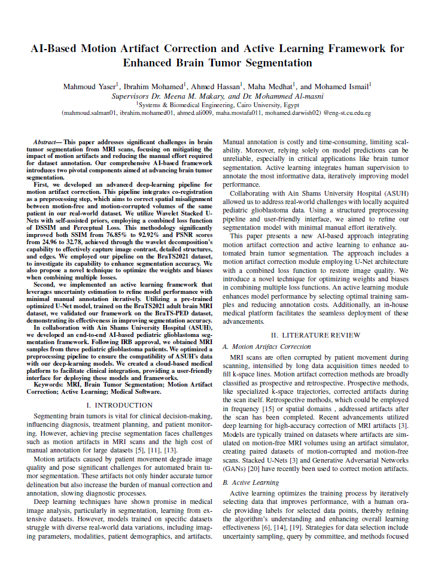
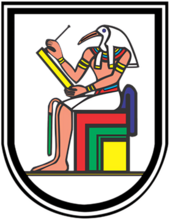
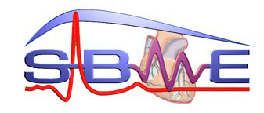
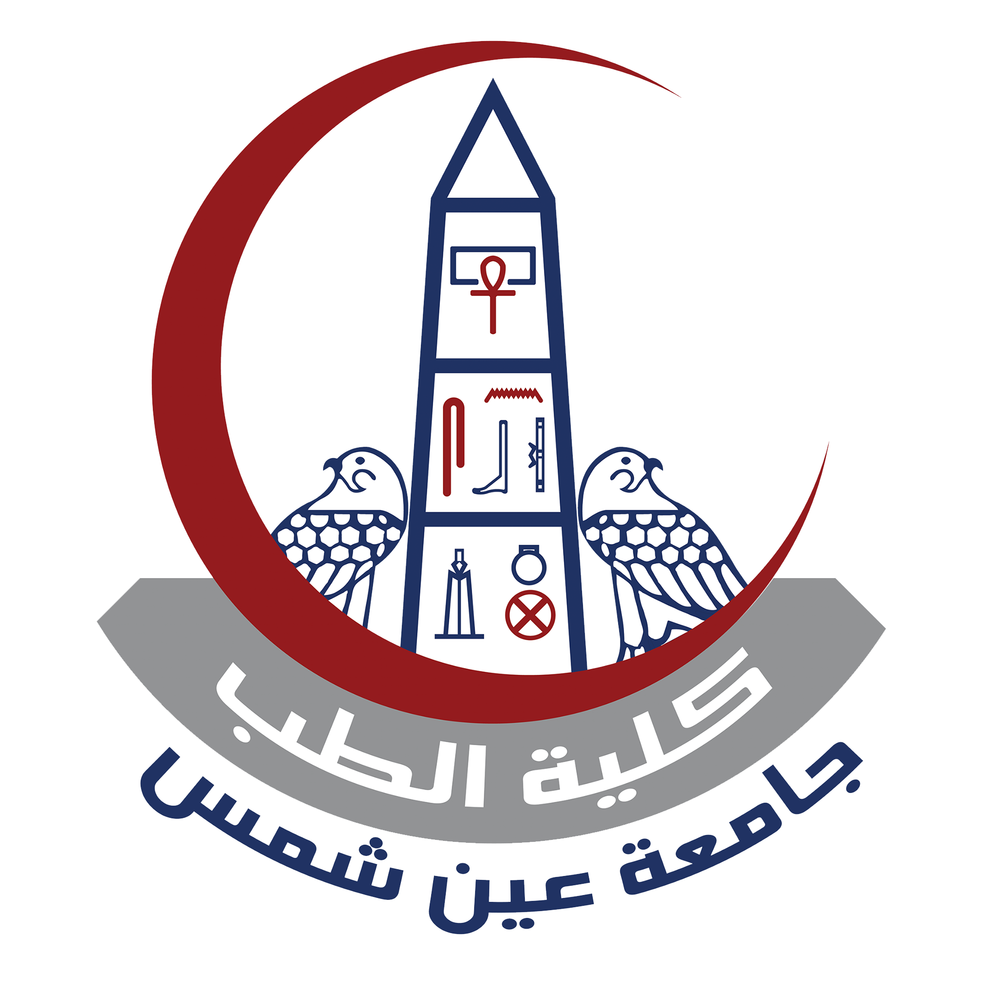

# Graduation Project

## Table of Contents

- [Abstract](#abstract)
- [Overview](#overview)
- [Features](#features)
- [Research and AI Work](#)
- [Software Development](#software-development)
    - [Technologies](#technologies)
    - [Installation and Setup](#installation-and-setup)
        - [Using Docker](#using-docker)
        - [Manual Installation](#manual-installation)
- [Team](#team)

### Abstract

This project addresses significant challenges in brain
tumor segmentation from MRI scans, focusing on mitigating the
impact of motion artifacts and reducing the manual effort required
for dataset annotation. Our comprehensive AI-based framework
introduces two pivotal components aimed at advancing brain tumor
segmentation.

- First, we developed an **advanced deep-learning** pipeline for
  ***motion artifact correction***. This pipeline integrates co-registration
  as a preprocessing step, which aims to correct spatial misalignment
  between motion-free and motion-corrupted volumes of the same
  patient in our real-world dataset. We utilize Wavelet Stacked UNets with self-assisted priors, employing a combined
  loss function
  of DSSIM and Perceptual Loss. This methodology significantly
  improved both SSIM from 76.85% to 92.92% and PSNR scores
  from 24.96 to 32.78, achieved through the wavelet decomposition’s
  capability to effectively capture image contrast, detailed structures,
  and edges. We employed our pipeline on the BraTS2021 dataset,
  to investigate its capability to enhance segmentation accuracy. We
  also propose a novel technique to optimize the weights and biases
  when combining multiple losses.


- Second, we implemented an **active learning** framework that
  uses uncertainty estimation to refine model performance with
  minimal manual annotation iteratively. Utilizing a pre-trained
  optimized U-Net model, trained on the BraTS2021 adult brain MRI
  dataset, we validated our framework on the BraTS-PED dataset,
  demonstrating its effectiveness in improving segmentation accuracy.

In collaboration with **Ain Shams University Hospital (ASUH) - El Demerdash**,
we developed an end-to-end AI-based pediatric glioblastoma segmentation framework. Following IRB approval, we obtained
MRI
samples from three pediatric glioblastoma patients. We optimized a
preprocessing pipeline to ensure the compatibility of ASUH’s data
with our deep-learning models. We created a cloud-based medical
platform to facilitate clinical integration, providing a user-friendly
interface for deploying these models and frameworks

### Overview

The project is divided into two main parts:

1. AI Research Work
    1. Motion Artifact Correction
    2. Active Learning
2. Software Development ( Web Application )
    1. Frontend
    2. Backend Microservices
        1. Orthanc DICOM Storage
        2. BDIS Compliant NIfTI Storage (Built from scratch)
        3. AI Models Deployment
            1. Segmentation Models
            2. Motion Artifact Correction Model
            3. Synthesis Model
        4. Reporting Service
        5. RabbitMQ Message Broker
        6. Logging Service

Systems Design and Components
![[SW] system design.png](files%2Fimages%2F%5BSW%5D%20system%20design.png)

### Features

- Medical Image Import and Compatibility
    - [x] Upload and store DICOM Images
    - [x] Upload and store NIfTI Images
    - [x] Upload and store Segmentation Masks
- Manual & Automatic Segmentation
    - [x] 2D & 3D Manual Segmentation using Brush Tool
    - [x] 2D & 3D Manual Segmentation using Polygon Tools (Rectangle, Circle, Freehand)
    - [x] 2D & 3D Automatic Segmentation using AI Models (Nvidia nnU-Net)
    - [x] Export Segmentation Masks as DICOM-SEG
    - [x] Import Segmentation Masks as DICOM-SEG
- Motion Artifact Correction from T1-Weighted MRI Scans
- Brain MRI Sequence Synthesis
    - [x] FLAIR from T1, T2 and T1c
    - [x] T2 from T1, T1c and FLAIR
    - [x] T1 from T2, T1c and FLAIR
- Image Viewing and Navigation
    - [x] 2D Image Viewer
    - [x] 3D Image Viewer
    - [x] Pan, Zoom, Rotate
    - [x] Slice Navigation
    - [x] Window Leveling
    - [x] Rotate Image & Flip Image
    - [x] MPR (Multiplanar Reconstruction)
    - [x] 3D Volume Rendering
- Image Measurements and Annotations
    - [x] Distance Measurement
    - [x] Angle Measurement
    - [x] Area Measurement (Rectangle, Circle, Polygon, Freehand ROIs)
    - [x] Volume Measurement
    - [x] Text Annotations
    - [x] Arrow Annotations
    - [x] Export Measurements and Annotations
    - [x] Import Measurements and Annotations
- PACS Integration with DICOM-Web
    - [x] DICOM Query/Retrieve
    - [x] DICOM Store
    - [x] DICOM Modality Worklist
- [x] Generate Radiology Reports
- [x] Authentication and Authorization
    - [x] Login
    - [x] Role-based Access Control
    - [x] Register
- In-App Notifications
- Easy and Standard User Interface
    - [x] Dark & Light Modes
    - [x] Responsive Design (Mobile, Tablet, Desktop)
    - [x] User-friendly Interface for Radiologists
- Extendable with AI Models
- Non-Functional Requirements
    - [x] Cloud-Based
    - [x] Caching
    - [x] Logging
    - [x] GPU Acceleration for image processing and rendering
    - [x] HIPAA Compliant as much as we can
    - [x] Following ISO/IEC 62304:2006 Software life cycle processes for medical device software

### Research and AI Work

For more details about the research and AI work used in this project, please refer to our
Paper [here](https://www.overleaf.com/read/cbwwqtnzbkyj#6b784c)


### Software Development

#### Technologies

###### Frontend

- ReactJS
- Cornerstone3D
- Redux Toolkit
- TailwindCSS
- Material-UI
- React-Router
- axios
- dcmjs
- dicom-parser
- dicomweb-client
- pino
- react-spinners
- react-toastify

###### Backend

- Django
- Django Rest Framework
- Orthanc DICOM Server
- RabbitMQ
- FastAPI
- NodeJS

###### Database

- PostgreSQL

###### AI Development

- PyTorch
- TensorFlow
- Kaggle
- Google Colab

###### Deployment

- Docker
- Docker Compose
- AWS
- Jenkins
- Github Actions

###### General Development Tools

- Postman for API Testing and Documentation
- Figma for UI/UX Design
- Swagger for API Documentation
- Ubuntu for Development and Production Servers
- GitHub Projects for Project Management
- 3D Slicer for Medical Image Processing and verification
- FSL (FMRIB Software Library) for Medical Image Processing
- ITK-SNAP for Medical Image Visualization and Segmentation

#### Installation and Setup

##### Using Docker

1. Clone the repository

```bash
git clone [repo]
```

2. Change directory to the Software folder

```bash
cd [repo]
```

3. Run the following command

```bash
docker-compose up
```

It will pull and build the images and start the services

4. Open your browser and navigate to `http://localhost:5000`

##### Manual Installation

1. Clone the repository

```bash
git clone [repo]
```

2. Change directory to the Software folder

```bash
cd [repo]
```

3. Install the dependencies for each backend service
4. Run the backend services
5. Install the dependencies for the frontend
6. Run the frontend service
7. Open your browser and navigate to `http://localhost:5000`

#### Docs

- [API Documentation](https://documenter.getpostman.com/view/13468200/TzJx9G8z)
- [Software Requirements Specification](https://docs.google.com/document/d/16Noy_fc9k46Y9mbxoajGpLqtA1F2Pb0r/edit?usp=sharing&ouid=113231363802185797314&rtpof=true&sd=true)

### Demo Video

[](https://youtu.be/39xGJ3qiYI0)

### Team

<table>
    <tbody>
     <tr style="border: none">
        <td style="border: none" align="center" valign="top" width="20%" >
            <a href="https://github.com/1brahimmohamed">
                
                <br/>
                <sub><b>Ibrahim Mohamed</b></sub>
            </a>
            <br/>
            <span>Software Development</span>
        </td>
        <td style="border: none" align="center" valign="top" width="20%">
            <a href="https://github.com/MohamedAIsmail">
                
                <br/>
                <sub><b>Mohamed Ismail</b></sub>
            </a>
            <br/>
            <span>Software Development</span>
        </td>
        <td style="border: none" align="center" valign="top" width="20%">
            <a href="https://github.com/mahmoud1yaser">
                
                <br/>
                <sub><b>Mahmoud Yaser</b></sub>
            </a>
            <br/>
            <span>Research & AI </span>
        </td>
        <td style="border: none" align="center" valign="top" width="20%">
            <a href="https://github.com/ahmedhassan187">
                
                <br/>
                <sub><b>Ahmed Hassan</b></sub>
            </a>
            <br/>
            <span>Research & AI </span>
        </td>
        <td style="border: none" align="center" valign="top" width="20%">
            <a href="https://github.com/mahamedhat">
                
                <br/>
                <sub><b>Maha Medhat</b></sub>
            </a>
            <br/>
            <span>Research & AI </span>
        </td>
    </tr>
</tbody>
</table>

### Supervisors

<table>
    <tbody>
    <tr style="border: none">
        <td align="center" valign="top" width="14.28%" style="border: none;">
            <a href="https://scholar.google.co.kr/citations?user=y_8D7KEAAAAJ&hl=en">
                
                <br/>
                <sub><b>Dr. Meena M. Makary</b></sub>
            </a>
            <br/>
            <span>Associate Professor, Systems & Biomedical Department Cairo University</span>
            <br>            
            <span>Research Scientist | Radiology, Harvard Medical School</span>
        </td>
        <td align="center" valign="top" width="14.28%" style="border: none;">
            <a href="https://scholar.google.com/citations?user=7nV1crUAAAAJ&hl=en">
                
                <br/>
                <sub><b>Dr. Mohammed Al-masni</b></sub>
            </a>
            <br/>
            <span>Assistant Professor, Department of Artificial Intelligence, Sejong University, South Korea</span>
        </td>
    </tr>
     <tr style="border: none">
        <td align="center" valign="top" width="14.28%" style="border: none;">
            
            
        </td>
        <td align="center" valign="top" width="14.28%" style="border: none;">
            
        </td>
    </tr>
    </tbody>
</table>


This project was made in Collaboration with Ain Shams University Hospital (ASUH)
as an IRB protocol was submitted.

<div style="display: flex; justify-items: center; align-items: center">


</div>
